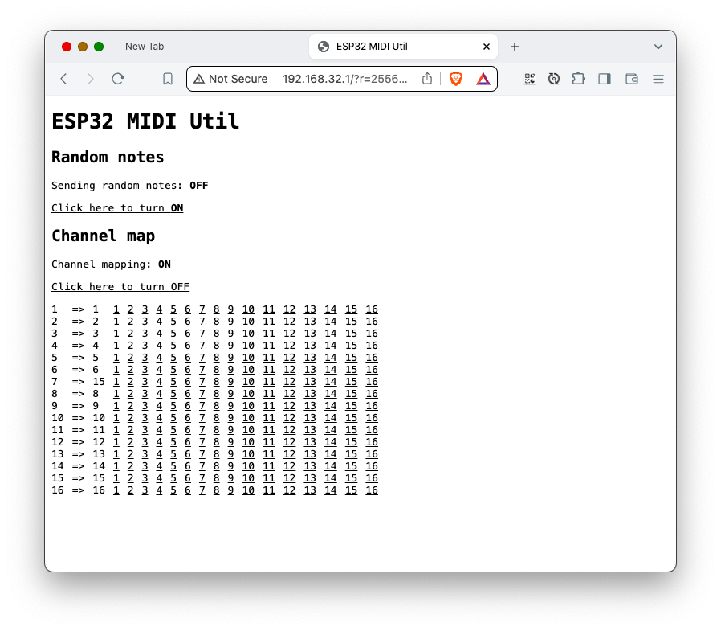

# ESP32 MIDI Util

MIDI utility that runs in ESP32 microcontroller.
It does two things:
1. Sends random notes to all channels periodically
2. Allows changing the MIDI channel of the incoming MIDI messages 

MIDI is communicated via UART and needs a MIDI shield to be connected to the ESP32.

A runtime configuration interface is provided via HTTP server which is available via self-hosted WiFi access point. 

